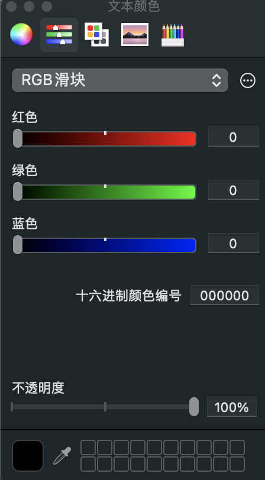
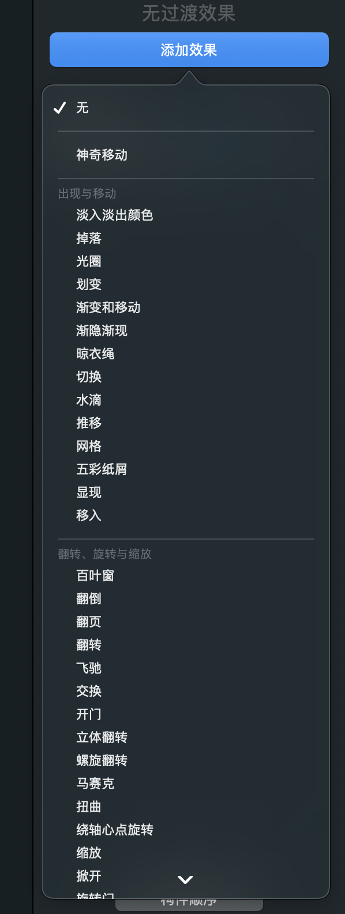

## 前言
在平常工作中，如果我们要做分享或者汇报，更倾向于去写 wiki 文档而不是 keynote，其原因主要是因为
keynote 的成本更高，合适的模板比较少，更占用时间，而 wiki 则可以利用语雀等平台的能力去自上而下的分享和总结，成本更低。

作为我，更倾向于去写 keynote，虽然 keynote 对个人能力要求更高，也对审美和设计有一定要求，但是每次设计一个 keynote，也是自我锻炼的一次机会，勇敢牛牛不怕丑。在写 keynote 过程中，你会更精简思路，不断打磨需要表述的内容，这样最后表达的内容也会更加完美。

一般来说，写 keynote 需要两个准备：
* 大纲准备
* 基本素材库

大纲就是弄一个 md，写一个需要表述的内容罢了。然后创建一个 ppt，在每个页面中，用文字先描述这个页面需要写的内容即可。

基本素材库最简单的就是直接按照 keynote 自带的模板来做就好。如果有资源的话，可以利用公司提供的一些模板，比如字节、美团都有一些常用的研发和产品模板，这些模板都能提供不错的视觉效果。

对于想要挑战自己的，可以试试 vue 的 slidev 工具，用 md 的形式来写分享。不过我用了一段时间，发现成本还是太高了，资源也相对比较少，可视化还是比代码要更快速一些。不过里面代码的样式是可以借鉴的，有兴趣可以看看。

## 素材

### 颜色
- https://colorhunt.co/

### 图标

网站：
- https://www.flaticon.com/icons 下载一些图片

### 动画
